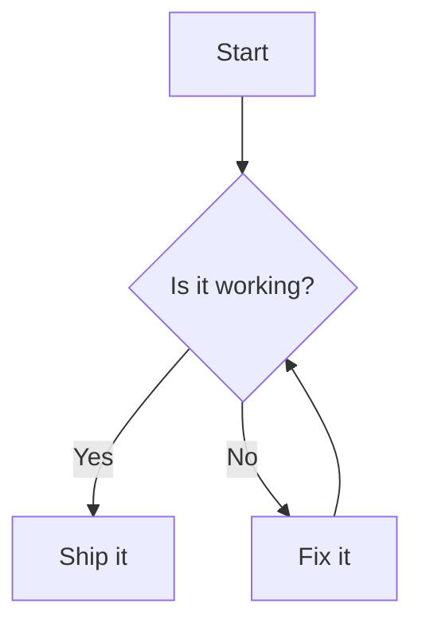

Welcome to the blog. This is a sample post.

Here is inline math: $E=mc^2$ and a block:

$$
\int_0^1 x^2 \, dx = \frac{1}{3}
$$

```mermaid
graph TD
  A[Start] --> B{Is it working?}
  B -- Yes --> C[Ship it]
  B -- No --> D[Fix it]
  D --> B
```

